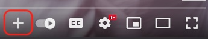
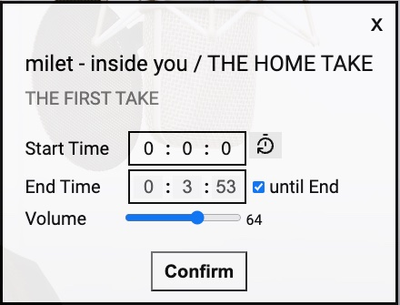
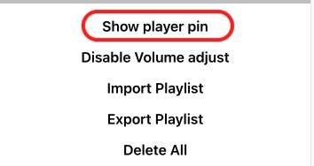
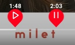
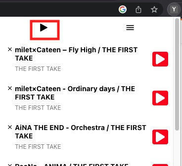

# Assumption

1. No Ads in your Youtube

# Description

This Chrome extension allows users to bookmark their favorite YouTube music videos and create a playlist from those selections. Simply click the bookmark button on any YouTube video to add it to your playlist

# Incentive

1. Sometimes, when playing a YouTube playlist, you may be redirected to a video that is not on the playlist.
1. Some YouTube videos may have long intros/closing that you might want to skip. A Chrome extension let you to set the start and end times for these videos, allowing you to jump straight to the content that you want to listen.

# To Start

In the project directory, you can run:

1. `npm run build`

1. Builds the app to the `build` folder.

1. go to `chrome://extensions/` or `edge://extensions/`

1. `load unpacked` the `build` folder

1. Reopen the browser

# How to use

## Add new video

1. To add a new video to your YouTube playlist, click the "+" button at the bottom right corner of the video's play bar. 
   
1. When you click the "+" button, a dialog will pop up. You can modify the start and end times for the video by using the options provided in the dialog. When you are finished, click "Confirm" to add the video to your playlist. 
   
1. To track the start and end times you want for your video, you can enable the pin in the settings and use it to select the desired time. The pin position will automatically update the input field in the dialog. 
   
   

## Play the playlist

1. To start playing the playlist, simply click the play button located in the top left corner.  
   
1. To play a specific video, click the play button located on the right side of the listed item.
