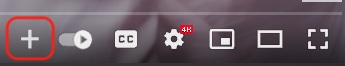

# YouTube Playlist Chrome Extension

A Manifest V3 Chrome extension for saving YouTube videos into a personal playlist with custom playback settings. Each saved item can include a start time, optional end time, volume level, and EQ setting so music videos, live sets, and long uploads can sound and begin exactly how you want.

## Features

- Save the current YouTube video from the player controls.
- Set custom start and end timestamps for each saved video.
- Store per-song volume levels and EQ settings.
- Play one video, play the full playlist in order, or play the playlist randomly.
- Reorder, edit, import, export, and delete playlist items from the popup.
- Select multiple songs for batch actions.
- Import YouTube playlists and review detected playlist updates.
- Configure EQ profiles and optional Gemini-assisted playlist and per-song EQ workflows.

## Assumption

This extension is designed for YouTube playback without ads interrupting the saved timestamp flow.

## Getting Started

1. Install dependencies:

   ```sh
   npm install
   ```

1. Build the extension:

   ```sh
   npm run build
   ```

1. Open `chrome://extensions/` or `edge://extensions/`.
1. Enable developer mode.
1. Click `Load unpacked`.
1. Select the generated `build` folder.
1. Reopen YouTube tabs after loading or updating the extension.

## Development

Run the full test suite:

```sh
npm test
```

Build all extension targets:

```sh
npm run build
```

Create a build with seeded development playlist data:

```sh
npm run build:seed
```

The build command compiles the popup, background service worker, and YouTube content script with separate Vite configs.

## How To Use

### Add a Video

1. Open a YouTube video.
1. Click the `+` button in the video's player controls.

   

1. In the dialog, adjust the start time, optional end time, volume, and EQ setting.
1. Click `Confirm` to save the video to your extension playlist.
1. To choose timestamps from the video player, enable the pin setting and use the pin while watching the video. The selected time is copied into the dialog field.

### Play The Playlist

1. Open the extension popup.
1. Click the main play button to start playlist playback.
1. Use the item-level play button to start a specific video.
1. Use the menu actions to switch playback mode, manage settings, import/export playlist data, or delete playlist items.

### Edit Saved Items

1. Open the extension popup.
1. Choose a saved item.
1. Update its start time, end time, volume, or EQ setting.
1. Save the changes and replay the item to use the new settings.

### Import And Export

Use the popup menu to export your saved playlist as JSON or import a previously exported playlist. Imported data is validated before it is merged into storage.

## Project Layout

- `public/manifest.json`: Extension manifest, permissions, and entry points.
- `src/App.tsx`: Popup root.
- `src/screens/playlist/`: Playlist UI, import/export flows, selection actions, and playback controls.
- `src/screens/modal/`: Saved-item editing UI.
- `src/screens/gemini/`: Gemini settings, approval, and assistant-driven playlist/EQ screens.
- `src/background/`: Playback orchestration, playlist import detection, Gemini requests, and extension message handling.
- `src/contentScript/`: YouTube page integration, bookmark dialog, player controls, and YouTube DOM helpers.
- `src/utils/`: Storage, playlist transforms, themes, EQ profiles, and shared helpers.

## Notes

- Saved playlist data is stored with `chrome.storage.sync`.
- Runtime playback state is stored with `chrome.storage.local`.
- YouTube DOM changes can affect the content script because the extension integrates directly with the YouTube player page.
