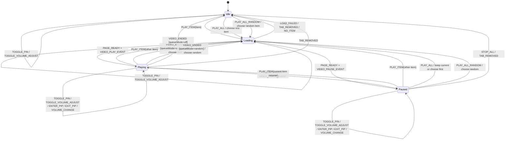

# Playback State Machine

This document describes the proposed explicit playback state machine for the extension background worker.

## State Model

- `status`: `idle | loading | playing | paused`
- `queueMode`: `off | sequential | random`
- context:
  - `currentItemId`
  - `currentTabId`
  - `isPip`
  - `enablePin`
  - `enableAdjustVideoVolume`

## Mermaid Diagram



## Proposed State Shape

```ts
type PlaybackStatus = "idle" | "loading" | "playing" | "paused";
type QueueMode = "off" | "sequential" | "random";

interface PlaybackState {
  status: PlaybackStatus;
  queueMode: QueueMode;
  currentItemId: string | null;
  currentTabId: number | null;
  isPip: boolean;
  enablePin: boolean;
  enableAdjustVideoVolume: boolean;
}
```
